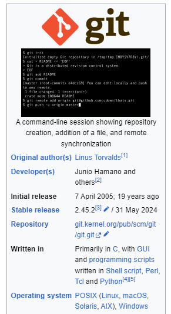
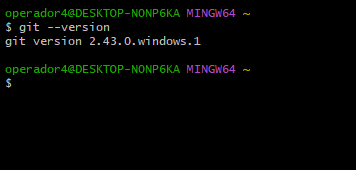
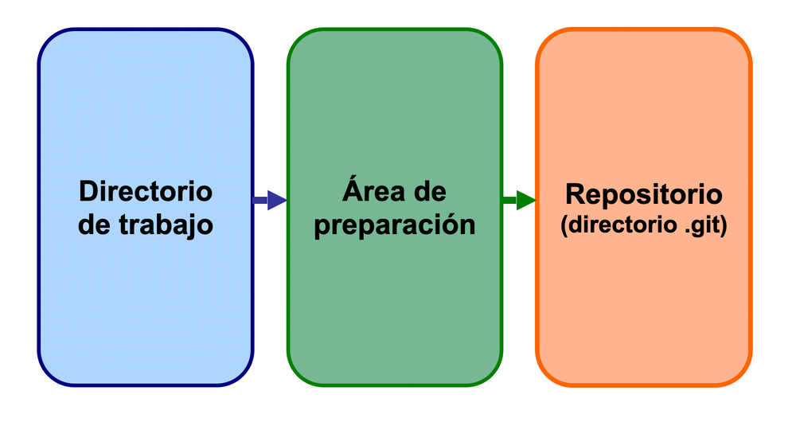
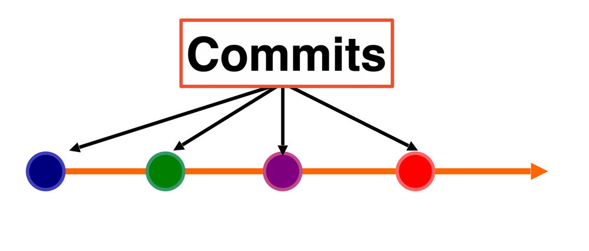
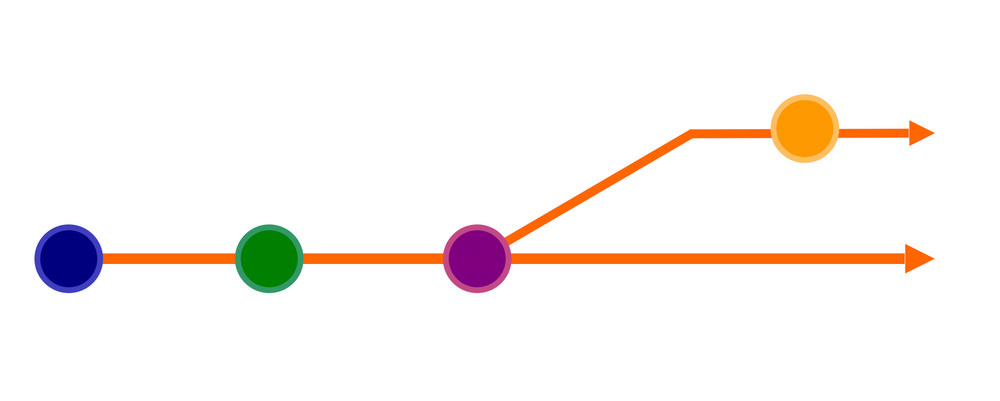
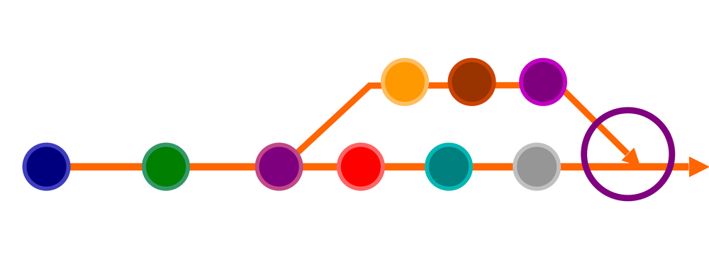

### 1 - Introducción a GIT

Trabajar con nuesto código de forma segura es tan importante como aparender a programar. 
  
Hay dos conceptos distintos que vamos a trabajar en este eje, **Git** y **GitHub**

###### Git es un VCS de código abierto, ditribuido, rápido, versátil, muy escalable y gratuito. 
###### GitHub es una plataforma en la nube que usa Git como tecnología principal. 

En esta primer seccion nos vamos a concentrar unicamente de **Git**. 
    
  * Git, es independiente de GitHub. GitHub depende de Git
  * Web oficial de GIT es: https://git-scm.com
  * Es de código abierto. Todo su código fuente se pude leer en GITHUB.
  * Git es un sistema de control de versiones distribuido.
  * Libro oficial en español: https://git-scm.com/book/es/v2
  
La principal diferencia con respecto a otros sistemas de control es que se basa en una arquitectura distribuida, es decir, no cuenta con un único espacio en donde almacenar el histórico de versiones sino que facilita que cada desarrollador pueda guardar el historial completo de todas las modificaciones que ha realizado. Probablemente, esa característica sea la principal causa de su popularidad, pues git nos permite: 

  * Registrar historico de trabajo código
  * Crear copias de seguridad
  * Trabajar en equipo de forma rapidad y sin errores
       
### 2 - Historia de Git

**Git was created for use in the development of the Linux kernel by _**Linus Torvalds**_ and others developing the kernel. 2005**

  

Desde que en 2005, el ingeniero de software Linus Torvalds (padre del kernel del sistema operativo Linux) diseño Git como un sistema de código abierto con el que supervisar la versiones, este ha ido evolucionando y presentando actualizaciones periódicas, adaptándose a las necesidades que surgen con la permanente evolución de la tecnología digital hasta convertirse en una herramienta indispensable para la mayoría de los desarrolladores.

### 3 - Instalación de Git

Git es una herramienta por consola de comandos que se integra bastante bien en los principales editores de programación existente. A continuación te indicamos cómo instalarlo para los diferentes sistemas operativos. 

**Instalar Git en Windows**

Sólo debe descargarse el instalador correspondiente desde la página oficial del proyecto Git y descargar el instalador correspondiente al sistema operativo usado teniendo en cuenta la arquitectura de nuestro sistema: 32 o 64bits.

https://git-scm.com/downloads

El instalador para Windows abrirá un asistente que mostrará una serie de opciones durante el proceso. Dejar las opciones marcadas por defecto será suficientes en la mayoría de las situaciones.

### 4 - Comandos básicos de la terminal

Vamos a comenzar a trabajar por consola creando un proyecto sencillo con Git en forma local para entender cómo funciona y vamos a ver los comandos básicos a utilizar tanto de linux como especificamente de git. Luego la idea es ver como se integra git con Visual Studio Code

Abrir  Git Bash --> Luego de la instalción, localizar en acceso a la consola "Git Bash"

GIT BASH es una herramienta de línea de comandos para Windows que nos permite ejecutar comandos de Git.

💡 Tip: Bash significa Bourne Again Shell. Un bash es una aplicación usada para interactuar con el sistema operativo de una computadora a través de comandos.

Una vez que el proceso haya terminado correctamente, compruebe la instalación ejecutando git de prueba con:

> git --version

> git -v

> git --help 

> git -h

  #### Comandos básico desde la terminal:

listar directorio actual
> ls -lha

change directory
> cd

print working directory
> pwd

make directory
> mkdir "directory name"

Clear console
> clear

Crear archivo
> touch "nombre de archivo.ext"

### 5 - Configuración de Git

Asociamos por única vez nuestro usuario y email

--Configuracion global:

> git config user.name "lole-s"  

> git config user.email "jcsodo@gmail.com"

* ver archivo de configuración C:/Users/operador4/.gitconf o verificar config con el sig. comando

> git config --list

### 6 - Iniciar control de versiones para el directorio de nuestro proyecto. "git init"

Crear una carpeta de proyecto nuevo

> mkdir miProyecto

> cd miProyecto

> ls -alh

--inicializar el contexto de un control de versiones en el directorio raiz del proyecto

> git init

O bien si no quieres posicionarte en la carpeta puedes darle la dirección de la misma como argumento al comando

> git init "directorio"

Listamos nuevamente los archivos y directorios de nuestro proyecto

> ls -alh

y vemos que se ha creado el directirio ".git"

**a partir de aquí el directorio trabaja con control de versiones**

--ver directorio oculto "../miProyecto/.git/" en el cual se guarda la logica de git para este proyecto

--el .git indica que el directorio trabaja con control de versiones

### 7 -  Conceptos básicos de Git

**¿Cómo funciona Git al momento de administrar mi proyecto?**

Entender el funcionamiento de Git normalmente es muy fácil, pero se vuelve confuso al momento de llevarlo a la práctica. Para simplificar  tratemos de verlo en  imágenes:

###### Primero: tanto al momento de crear un proyecto como cuando lo clonamos, tendremos 3 áreas de importancia que son parte del software Git:

* **La carpeta (directorio) o área de trabajo (Working Área)**

* **El área de ensayo o preparación (Stagin Área)**

* **Nuestro repositorio local («.git»)**

#### Los siguientes conceptos son esenciales para trabajar con Git.

**Repositorio (Repository)**
Un repositorio es donde Git almacena los archivos de tu proyecto y las distintas versiones de tus archivos. Un repositorio puede ser local o remoto. Un repositorio local se guarda de forma local en tu computadora. Un repositorio remoto se guarda en los servidores del servicio de hosting que escojas (por ejemplo, GitHub).

**Directorio de trabajo (Working directory)**
Este es el directorio del proyecto en el sistema de archivos, donde se guardan los archivos. Esta es, por ejemplo, la carpeta que abres en tu editor de código o IDE para trabajar con tus archivos.

**Área de preparación (Staging area)**
Este es el conjunto de archivos y cambios que serán incluidos en el siguiente commit. Podemos agregar y remover archivos de esta área si es necesario.

**Confirmar Cambios (Commit)**
Un commit es como una "foto" de tu proyecto en un momento en particular. Un commit registra un cambio que se realizó en el proyecto. Tú escoges cuándo crear un commit y qué incluir en el commit.
  * Para describir los cambios registrados en un commit, escribimos un mensaje de commit que podemos verificar al trabajar en el proyecto.

**Rama (Branch)**
Una rama es una línea independiente de desarrollo de un proyecto que es administrada y rastreada por Git. Cada proyecto iniciar con una rama por defecto que normalmente llamamos MAIN o MASTER. Podemos crear una rama para trabajar en un aspecto nuevo del proyecto sin afectar la versión principal.

**Fusionar (Merge)**
Podemos combinar o fusionar (merge) ramas si necesitamos incorporar los cambios que hicimos en una rama en otra rama. Esto es lo que normalmente hacemos cuando un aspecto nuevo está listo para ser incorporado a la versión en vivo del proyecto.

### 8 - "git status", "git add" y "git commit"

-- ver estado de proyecto

> git status

> Not commits yet

-- creo un nuevo archivdo dentro de mi proyecto

> touch hellogit.py

> git status

**Status:** 
El comando «git status» nos mostrará el estado del directorio de trabajo, es decir, de donde estamos posicionados trabajando y también aquellos archivos que Git está siguiendo. 
Vemos que Git nos indica que estamos sobre la rama «master» que es la principal de los proyectos. Y que además no hemos realizado ningún Commit todavía, por lo que no hay un punto de referencia al que volver. No hemos realizado cambios, pero lo más importante es que nos muestra un archivo en letra rojas.  Y nos avisa que estos archivos no están siendo seguidos. Así que vamos a seguirlos. Usando el comando «git add».

--preparar archivos para la primer foto del proyecto

**Add (Seguimiento de archivos):**
En Git el proceso de guardar resulta diferente a el clásico «guardar» al que estamos acostumbrados. En git podemos verlo como «ir confirmando cambios a distintos niveles».

Al utilizar el comando «git add» seguido del nombre de un archivo o bien utilizando un comodín «.» para todos los archivos del directorio, estamos ordenando a Git realizar un seguimiento del mismo. Lo que significa que nos avisará cuando se hagan cambios.
Cada vez que modifiques el archivo con tu editor de código y des «guardar..» en el mismo. Git detectará que el archivo ha cambiado.. Y haciendo otro «git status» lograrás verlo en rojo nuevamente.

Como para ejemplificar esto a continuación añadiremos el archivo nuestro a seguimiento:

> git add hellogit.py

o bien podemos usar comodín para añadir todos los archivos que se encuentren en el directorio

> git add .

Al hacerlo simplemente Git no nos mostrará nada, pero al volver a solicitar un «estado» mediante «git status» veremos lo siguiente:

> git status

Donde ahora vemos el archivo como agregado para seguimiento de cambios. Pero sin ninguna foto (commit)

--Hacemos la primer confirmación o foto del proyecto

> git commit -m  "este es mi primer commit"
>
> git status

#### Git log

--git añade un hash al commit para identificar el momento de la foto

> git log

> commit fb8e3eb7742961cafcac4f25b4ce098d91c0fda0
>
> Author: lole-s <jcsodo@gmail.com>
>
> Date:   Wed Feb 21 08:51:34 2024 -0300
>
>    este es mi primer commit

-- Creamos y agregamos un 2 archivo

> touch hellogit2.py

> vim hellogit2.py

>	print ("hello Git!")

> git status
 
> git add hellogit2.py

> git status

> git commit -m  "este es mi 2do commit"

> git log

#### "git diff"

---MAIN---foto1---foto2---foto3(HEAD)--(sinfoto)

--nos fuimos moviendo, fuimos avanzando. siempre en la última posición pero podemos ver que hay hacia atras
--ahora hacemos una modificación a uno de los ficheros modifico y vemos que ocurre

> vim hellogit.py

>	print("PROA TESTING!")

--si quiero ver cuales son los cambios que he realizado con respecto a la ultima foto (foto3)
> git diff

#### Git alias

--ver listado de diferente maneras

> git log --graph

> git log --graph --pretty=oneline

> git log --graph --decorate ---all --oneline

--crear alias dentro de la configuración, ejemplo

> git config --global alias.log.deco "log --graph --decorate --all --oneline"

> git log.deco

#### Git ingnore

> touch git.txt
 
> git status

--quiero ignorar el archivo "git.txt" para que no me moleste cada vez que hago un status

> touch .gitignore
 
> ls
 
> git.txt  hellogit.py  hellogit2.py

> ls -a
 
> .git/  .gitignore  git.txt  hellogit.py  hellogit2.py

>vim .gitignore
**/git.txt

-- los ** indican que el 'git.txt' puede estar en cualquier carpeta de mi proyecto, igual lo va a ingnorar

> git status

no esta mas el "git.txt" como untracked, indica que el .gitignore ya esta efectando al proyecto

-- ahora añadimos el .gitignore al control de git porque es un archivo importante de nuestro proyecto

> git add .gitignore

> git commit -m "Se agrega el .gitignore"

> git status

-- ahora el árbol de trabajo esta limpio!!

#### Git checkuot - moverse en una rama

> git log

--copio el <hash> del la foto1. y la copio en git checkout <hash>

> git checkout fb8e3eb7742961cafcac4f25b4ce098d91c0fda0

--!!!desaparecieron los archivos y las modificaciones

-- si desaparecieron, pero ".git" sabe

--si quiero volver al estado en que estaba trabajando antes hago: 

> git log --graph --decorate ---all --oneline

--o con alias

> git log.deco 

--y copio el hash de la foto main

#### Git reset 

_____
* Apunte de Majo: https://drive.google.com/file/d/1sHgKrrea1-HpityOEYqFLjRdaum85CnW/view
* Curso Mouredev: https://www.youtube.com/watch?v=3GymExBkKjE&t=196s
* Curso freeCodeCamp.org: https://www.freecodecamp.org/espanol/news/aprende-git-y-github-curso-desde-cero/
* Repositorio con resumen simpificado:  https://github.com/royeden/instructivo-git
____
#### resumen: 

Git: es un software de control de versiones distribuido y nos permite administrar los cambios en el código.

GitHub: Es una plataforma web para alojar proyectos utilizando el sistema de control de versiones Git.

git init: crea la subcarpeta oculta “.git” donde se encuentra un mapa del proyecto.

git add: comienza a rastrear los archivos del proyecto.

git status: muestra el estado actual.

git commit: confirma los cambios realizados.

git log: muestra el historial de commits.

git diff: muestra las diferencias en el código.

git checkout: sirve para moverse entre una ramas.

git rm: elimina un archivo del proyecto

git reset: restablece un repositorio a un punto anterior.

git branch: lista todas las ramas locales.

git merge: combina los cambios en la rama actual.

git remote: crea, muestra y elimina conexiones a otros repositorios.

git push: envia los cambios a una rama remota

git pull: descarga los cambios y los combina en la rama actual.

git tag: crea, muestra y elimina etiquetas.

.gitignore: es un archivo que permite ignorar archivos o carpetas dentro del directorio del proyecto.

GitHub Pages: es una forma de mostrar un repositorio como un sitio web.

git clone: clona o copia un repositorio remoto.

Fork: Un fork significa bifurcación, supone copiar un proyecto y partir de este hacer modificaciones.

Pull Request: (PR) se utilizan para solicitar incorporaciones de cambios en repositorios remotos.

Issues: donde se puede informar errores de software o solicitar funciones que podría tener un repositorio.

Projects: se componen de issues, solicitudes de funciones y notas que se clasifican como tarjetas en las columnas de su elección.

Wiki: puede usar la wiki de un repositorio para compartir manuales de uso o documentación extensa.

Release: es la versión de un proyecto lista para su distribución.

Badges: (insignias) agregan información relevante acerca de un repositorio.

____
