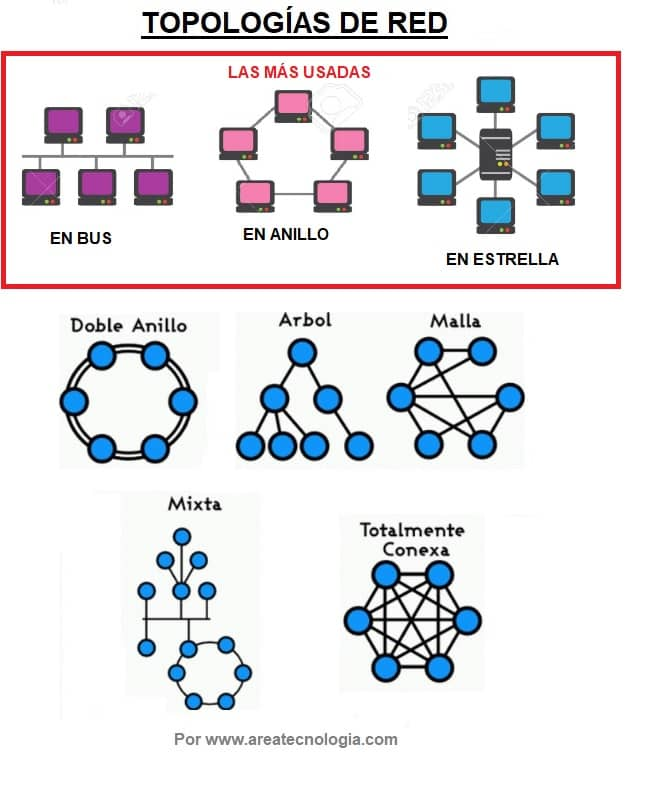

## Topologías de Red y acceso al Medio

### **Topologías de red:** Se denomina topología de red a la forma en que se organizan los componentes de una red (cables, tarjetas de red, otros equipos, etc.) Por lo tanto, es la forma, la apariencia de la red.

### **Medio de transmisión**: canal físico a través del cual se transmiten datos entre dispositivos. Puede ser guiado (como cables) o no guiado (como ondas de radio). En esencia, son los "caminos" por los que viajan las señales de información.

**Definición:**    El medio de transmisión es el soporte físico que permite que la información (datos, señales, etc.) viaje de un lugar a otro. Es el "puente" entre el emisor y el receptor de la comunicación. 
- Tipos:
    * Guiados (o alámbricos): Requieren un cable o guía física para la transmisión de la señal. Ejemplos: cables de cobre (par trenzado, cable coaxial), fibra óptica. 
    * No guiados (o inalámbricos): No requieren cables físicos para transmitir la señal. Ejemplos: ondas de radio, microondas, infrarrojos. 
- Importancia:
    Los medios de transmisión son fundamentales para la comunicación en redes de datos, sistemas de telecomunicaciones y cualquier sistema que requiera la transferencia de información. 
- Ejemplos de Medios de Transmisión:
    * Cables: Par trenzado, cable coaxial, fibra óptica. 
    * Inalámbrico: Radio, microondas, infrarrojos. 
- Consideraciones:
    La elección del medio de transmisión depende de factores como la distancia, la velocidad requerida, la seguridad, la sensibilidad a interferencias y el costo. 

___

**LAN:** son las siglas de *Local area network* (red de área local). Las LAN conectan dispositivos en una proximidad geográfica cercana (en el mismo edificio).

**WAN:** son las siglas de *Wide area network* (red de área extendida). Las WAN conectan dispositivos en ubicaciones geográficamente dispersas (en todo el mundo).
___

**MAC:**  la dirección MAC (siglas en inglés de *Media Access Control*) es un identificador de 48 bits (6 bloques de dos caracteres hexadecimales 8 bits) que corresponde de forma única a una tarjeta o dispositivo de red. Se la conoce también como dirección física, y es única para cada dispositivo.

**DIRECCIóN IP**

La **dirección IP** (Protocolo de Internet) es una etiqueta numérica única asignada a cada dispositivo conectado a una red informática que utiliza el Protocolo de Internet para la comunicación. 

Características claves sobre las direcciones IP:

* **Identificación:** Sirven para identificar de manera única cada dispositivo (ordenador, teléfono, router, servidor, etc.) dentro de una red, ya sea local o internet.
* **Ubicación:** Al igual que una dirección postal indica una ubicación física, una dirección IP indica la ubicación "virtual" de un dispositivo en la red.
* **Comunicación:** Son esenciales para dirigir el tráfico de internet. Cuando envías o recibes información en línea, la dirección IP asegura que los datos lleguen al destino correcto.
* **Formato:** Las direcciones IPv4, el tipo más común, se expresan como cuatro números separados por puntos (ejemplo: 192.168.1.38). Cada número puede variar de 0 a 255.
* **Tipos:** Existen diferentes tipos de direcciones IP, como las **públicas** (visibles en internet y asignadas por tu proveedor de servicios de internet) y las **privadas** (usadas dentro de una red local). También hay **direcciones estáticas** (fijas) y **dinámicas** (que pueden cambiar).

En resumen, una dirección IP es fundamental para que los dispositivos puedan comunicarse y transferir datos a través de internet y otras redes. Sin ellas, la "autopista de la información" sería un caos sin direcciones a dónde enviar o recibir los mensajes.
___

Comando: 
> ipconfig /all

ARP: 
> arp -a

---
topologías: https://youtu.be/Y2L_7ewQteI

¿Que es una red?: https://youtu.be/k2e6eWyn0fE?si=BqoCXP_s6yLNQYdx

¿Cómo funciona Internet?: https://www.youtube.com/watch?v=rw41W8crZ_Y

    - medios de transmisión (fibra) 
    - dirección ip 
    - dominos  -> dns
    - 
__________
### [Instalación de WireShark](https://www.wireshark.org/)

    ping 8.8.8.8
    ping elclubdelamilanesa.com
___________

