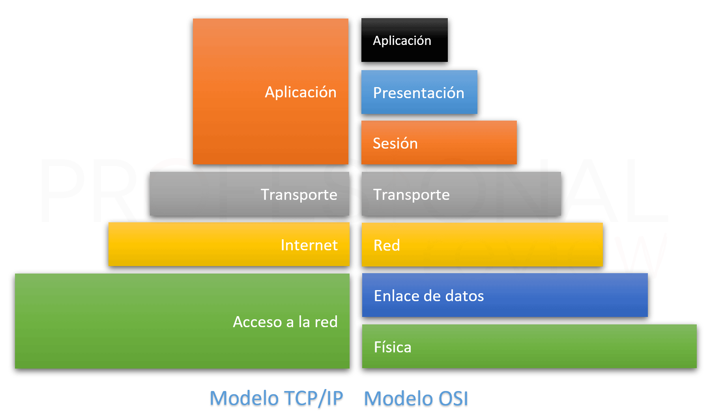

### REPASO: 

#### **¿Que es la topología de red?**    
**Es la forma en que se organizan los componentes de una red. Por lo tanto, es la forma, la apariencia de la red.
**

#### **¿Que es internet?**
  **Conjunto de redes interconectadas, descentralizadas y con alcance mundial. **

#### **¿Que son los protocolos en el ámbito de las telecomunicaciones?**    
**Es un conjunto de reglas y especificaciones que rígen las comunicaciones.
**

#### **¿Que es el Modelo TCP/IP?** 
**Conjunto de protocolos de red que permite la comunicación de datos entre dispositivos de redes informaticas. Creado en la decada del 70 y estandarizado en 1983 por la IETF. 
**
___

###### CURSO DE REDES - INICIOS DEL MODELO TCP IP
https://youtu.be/HnkkAi4eZ6c?si=JvNp6H0__dGfG0IK

###### MODELO OSI (TEORICO) - MODELO TCP IP (PRACTICO)
https://youtu.be/tYWXVHMlpCg

###### Prática para hacer en clase: 
https://blog.smaldone.com.ar/2006/11/21/tutorial-sobre-tcpip/

#### Palabras claves: 
* trama 
* encapsulación
* iana/lacnic 

___ 

#### LINKS DE INTERES 
###### Modelo TCP/IP (IETF) - Modelo OSI (ISO)
https://danimoreblog.wordpress.com/2013/05/29/rfc-y-osi/

###### Detalles sobre RFCs del Modelo TCP/IP 
https://fastercapital.com/es/contenido/TCP-IP--Explorando-los-RFC-que-definen-la-base-de-las-redes-modernas.html

###### Primer RFC
https://www.rfc-editor.org/rfc/rfc1.html

##### TCP IP es simple. 
https://blog.smaldone.com.ar/2006/11/02/tcpip-es-simple/
___

