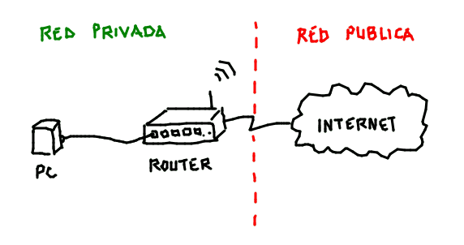

## ACTIVIDAD 
#### La libreta de direcciones

Hace algunos años teniamos que recordar muchos números de teléfono y los que no, los anotabamos en una agenda. Con la ayuda de los celulares y la información digital, cada vez necesitamos menos recordar números largos.

En la actividad anterior accedimos al servidor usando un número largo separado por puntos. Ese número representa una dirección IP, que es la forma en que se identifican los servicios que utilizamos en Internet, pero que no solemos ver ¡y menos recordar!

Nuestro primer objetivo es rastrear la verdadera dirección IP de algunos sitios.

Para encontrar la dirección IP correspondiente a un nombre de dominio podemos utilizar el navegador Google Chrome, escribiendo 

chrome://net-internals/#dns 

o acceder a algún servicio online como 

https://www.cdmon.com/es/conversor-host-ip.

Una vez elegido el método para encontrar las direcciones IP, completá la siguiente tabla:

| Nombre del dominio Dirección | IP |
| ---- | ---- |
| educ.ar | |
| www.gobstones.org | | 
| facebook.com | | 
| canaima.softwarelibre.gob.ve | | 
| www.convosenlaweb.gob.ar | | 
| gnu.org | | 

Luego, organizados en grupos, discutan y respondan las siguientes preguntas:
1. ¿Es lo mismo entrar a una página escribiendo el nombre de dominio que escribiendo su IP?
2. ¿Por qué creen que se inventaron los nombres de dominio?
3. ¿Cómo hará la computadora para descubrir qué IP le corresponde a un dominio?
4. ¿Es posible que una sola computadora tenga guardados todos los dominios que existen en el mundo?
5. ¿Por qué algunos dominios terminan en .com, otros en .org y otros en .ar?

_____
### **El dato**

Si las IPs son tan difíciles de recordar, ¿para qué existen? Los motivos son varios, pero hay uno que resulta particularmente interesante: el poco espacio que ocupan. Cualquier IP se puede representar con tan solo 4 bytes, mientras que para guardar texto se utiliza un byte por caracter; si quisiéramos representar algo tan corto como gnu.org necesitaríamos 7 bytes... ¡casi el doble!

Por esto y por la facilidad que tiene la computadora para hacer cuentas con estos números es que se utilizan las IPs. Las personas recordamos las palabras con más facilidad ya que además permiten asociar el nombre de dominio con el contenido de la página, por esta razón existen ambas formas.

____

#### Qué es una dirección IP
fuente: https://www.xataka.com/basics/que-direccion-ip-que-se-diferencia-direccion-mac

La dirección IP es el número que tiene tu dispositivo dentro de una red, y aunque normalmente se te asigna automáticamente cuando te conectas, hay casos en los que puede que seas tú quien la pueda elegir.

Sirve para distinguir a los dispositivos que están conectados a una red, por lo que viene a ser una especie de "matrícula" que te identifica cuando estás conectado o circulando por la web. Sin embargo, hay dos tipos de direcciones IP, las IP Públicas y las IP Privadas, y cada una de ellas tiene una finalidad totalmente diferente.

La **IP Pública** es la dirección que te asigna tu operador para identificarte dentro de Internet cuando te conectas. Aunque las hay fijas, lo más común es que sean dinámicas y vayan cambiando sin que te des cuenta cada cierto tiempo. Cuando nos referimos a nuestra dirección IP, normalmente solemos referirnos a esta, **a la pública**, que es tu matrícula de identificación cuando te conectas, y las direcciones IP (PUBLICAS) no se pueden repetir, por la que cada usuario tiene una que es única.

Nadie puede navegar por la red sin una IP, y ninguna página web puede estar online si no tiene una IP asociada. De hecho, cuando tú   escribes una dirección como 'www.google.com', lo que hace el navegador es traducir ese texto a una dirección IP para poder conectarse a la página de Google y acceder a su contenido.

La **IP Privada** es la dirección IP que se le asigna a los dispositivos dentro de una red privada o doméstica. Tu impresora, tu router, tu smartphone o tu ordenador, todos tienen una dirección propia dentro de tu red cuando se conectan a la misma WiFi, y sirve para que se puedan identificar y diferenciar entre ellos.

Las IPs privadas no se repiten dentro de una misma red, lo que quiere decir que cada aparato conectado de tu casa tendrá una IP diferente sin que se repita ninguna. Sin embargo, uno de los dispositivos de mi casa puede tener la misma IP que uno de los de tu casa, porque aquí estamos hablando de la red interna.

La cuestión es que independientemente de la IP privada que tenga cada dispositivo, cuando navegues por Internet su IP será la pública. Esto quiere decir que tu ordenador tendrá una dirección IP dentro de la red doméstica, pero en Internet tendrá otra diferente, porque pasará a tener la pública que te de tu operador.

Por último, debes saber que las direcciones IP están formadas por cuatro números de hasta tres cifras separados por puntos. Los valores de cada número pueden variar entre 0 y 255, por lo que una dirección IP podría ser 192.168.1.1, o cualquier otra de las miles de combinaciones posibles. Sin embargo, las direcciones que van de 10.0.0.0 a 10.255.255.255, de 172.16.0.0 a 172.31.255.255, y de 192.168.0.0 a 192.168.255.255 están reservados para las IPs privadas.

#### Qué es una dirección Mac

La dirección MAC es el identificador único que cada fabricante le asigna a la tarjeta de red de sus dispositivos. Se utiliza en los dispositivos conectados, esos que tienen tarjetas de red, como un ordenador portátil, un móvil, un router, una impresora, un televisor o incluso un Chromecast. Hay dispositivos que tienen varias tarjetas de red, como una para Ethernet y otra para WiFi. En estos casos, su dirección MAC dependerá de la tarjeta de red que usen para conectarse.

Las direcciones MAC están formadas por 48 bits representados generalmente por dígitos hexadecimales. Como cada hexadecimal equivale a cuatro binarios (48:4=12), la dirección acaba siendo formada por 12 dígitos agrupados en seis parejas separadas generalmente por dos puntos, aunque también puede haber un guión o nada en absoluto. De esta manera, un ejemplo de dirección MAC podría ser 00:1e:c2:9e:28:6b.

Estos dígitos no son aleatorios. Tres de las seis parejas de la dirección MAC identifican al fabricante, y la otra mitad al modelo del dispositivo. Por ejemplo, los números 00:1e:c2 del ejemplo de dirección pertenecen siempre al fabricante Apple Inc, mientras que los últimos seis determinan el modelo de dispositivo. Si tienes curiosidad, puedes encontrar buscadores especializados para saber el fabricante de un dispositivo dependiendo de los primeros seis dígitos de su MAC.

Como son identificadores únicos, las MAC pueden ser utilizadas por un administrador de red para permitir o denegar el acceso de determinados dispositivos a una red. Por lo general siempre son fijas para cada dispositivo, aunque existen maneras de cambiarlas en el caso de que quieras hacerlas más reconocibles en tu red o evitar bloqueos.

Es precisamente por esto, porque el MAC es el carnet de identidad único y que no puede alterarse de un dispositivo, que debes tener cuidado con dónde te conectas a Internet y a quién pertenece esta red. Cuando te conectas a una red, le estás dando tu MAC al router y al administrador para tener acceso a ella, y siendo un identificador único puede ser peligroso si cae en malas manos.

#### Diferencias entre dirección IP y dirección MAC

La primera diferencia de ambos tipos de dirección es la que se ve a simple vista, que su composición es totalmente diferente. Las direcciones IP están formadas por cuatro números de hasta tres cifras separados por puntos, y las MAC por 12 dígitos agrupados en seis parejas y separados por dos puntos. Esta es la diferencia que te permitirá distinguir qué dirección tienes frente a ti.

La otra diferencia es la conceptual, porque sirven para cosas diferentes. La dirección MAC identifica la tarjeta de red de un dispositivo y no puede variar, es fija y siempre es la misma. Mientras, la dirección IP varía, e identifica al dispositivo dentro de una red concreta, si es la doméstica es la dirección IP privada, y si es Internet la dirección IP pública.

Existe una similitud entre la utilidad de la IP privada y la dirección MAC, porque ambas sirven para identificar a un dispositivo dentro de la red. Sin embargo, la dirección MAC lo identifica dentro de cualquier red, porque se le asigna a la tarjeta de red del ordenador por el fabricante, mientras que la IP privada la asigna el router a cada dispositivo, varía dependiendo de la red, y se puede cambiar.

Viene a ser como si la dirección MAC es tu DNI. Tú entras en un estadio de fútbol a un partido y muestras el DNI. Mientras, la IP privada sería como tu entrada o tu número de asiento, que es lo que te identifica en este evento concreto. Sí, puede ser peligroso que cuando te conectas a Internet alguien sepa dónde te sientas, pero es mucho peor si tienen tu DNI.
