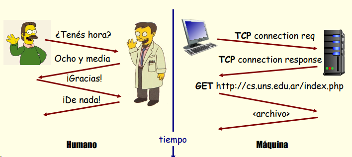
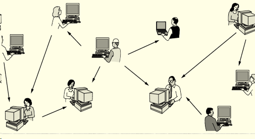
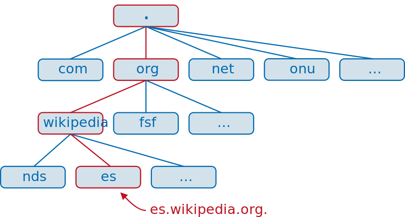

#### Nuestro Glosario: 

* **Red de computadoras**: es un conjunto interconectado de computadoras autónomas

* **Topología de red**: Es la forma en que se organizan los componentes de una red. Por lo tanto, es la forma, la apariencia de la red.

* **Internet**: Conjunto de redes interconectadas, descentralizadas y con alcance mundial.

* **Protocolos** (en el ámbito IT): Es un conjunto de reglas y especificaciones que rígen las comunicaciones.

* **Modélo TCP/IP**: Conjunto o suite de protocolos de red que permite la comunicación de datos entre dispositivos de redes informáticas. Creado en la decada del 70 y estandarizado en 1983 por la IETF.

* **Dirección MAC**: es un identificador de 48 bits (6 bloques de dos caracteres hexadecimales 8 bits) que corresponde de forma única a una tarjeta o dispositivo de red. Se la conoce también como dirección física, y es única para cada dispositivo.

* **Dirección IP**: Una dirección IP es un número de 32 bits. Identifica de forma única un host (equipo u otro dispositivo, como una impresora o enrutador) en una red TCP/IP. Las direcciones IP normalmente se expresan en formato decimal punteado, con cuatro números separados por puntos, como 192.168.123.132.
____

#### RED DE COMPUTADORAS

> Una red de computadoras, red de ordenadores o red informática es un conjunto de equipos nodos y software conectados entre sí por medio de dispositivos físicos que envían y reciben impulsos eléctricos, ondas electromagnéticas o cualquier otro medio para el transporte de datos, con la finalidad de compartir información, recursos y ofrecer servicios.

> Para poder formar una red se requieren elementos: **hardware, software y protocolos**.

> Los elementos físicos (hardware) se clasifican en dos grandes grupos:

>  * dispositivos de usuario final (hosts) : computadoras, servidores, impresoras, y demás elementos que esten conectada a una red a con un número de IP definidos. Su función es proporcionarle recursos, información y servicios directamente a los usuarios.
>  * dispositivos de red: son todos aquellos que conectan entre sí a los dispositivos de usuario final, posibilitando su intercomunicación.

## Entre los dispositivos de red se destacan:  

**Hub ( Concentrador )**: Es un dispositivo de red que se utiliza para conecta varios dispositivos (computadortas) entre sí. Es un dispositivo pasivo, lo que significa que no realiza ninguna manipulación de los datos recibe, solo transmite los paquetes a todos los puertos que contenga, esto es, si contiene 8 puertos, todas las computadoras que estén conectadas a dichos puertos recibirán la misma información. Por lo tanto, los hubs actúa sólo en el nivel físico o capa 1 del modelo OSI. **OBSOLETOS**
 
**Switch (Conmutador)**: es el dispositivo digital lógico de interconexión de equipos que opera en la capa de enlace de datos del modelo OSI (capa 2). Su función es interconectar dos o más host e intercambiar los datos transmitidos entre ellos de acuerdo a la dirección MAC de destino de las tramas o paquetes, mejorando el rendimiento y la seguridad de las redes de área local (LAN).

**Router**: también conocido como enrutador o encaminador — es un dispositivo que proporciona conectividad a nivel de red o nivel tres en el modelo OSI. Su función principal consiste en enviar o encaminar datos de una red a otra de acuerdo a la dirección IP destino del los paquetes IP, es decir, **interconecta subredes**.

____

###### Protocolos Relacionados: 

**DHCP** (Dynamic Host Configuration Protocol): es un protocolo cliente-servidor que proporciona automáticamente a los host de una red su dirección IP y otra información de configuración relacionados como por ejemplo, la puerta de enlace predeterminada y la máscara de subred. RFC 2131 y 2132 definen DHCP como un estándar de Internet Engineering Task Force (IETF)

**ICMP** (Internte Message Control Protocol): es un protocolo de control de la capa de red que utilizan los dispositivos de red para diagnosticar problemas de comunicación en la red. El ICMP se utiliza principalmente para determinar si los datos llegan o no a su destino a su debido tiempo (ping).

**ARP** (Address Resolution Protocol): protocolo de resolución de direcciones, para encontrar la dirección física (MAC) correspondiente a una determinada IP.

_____

### Hub - Switch - Router 
https://www.youtube.com/watch?v=Gky8-OVYmT4

___
Comandos: 

> >arp -a

> >ping 

> >tracert
 
> >netstat -n

> >netstat -r

____

##### MODELO CLIENTE SERVIDOR 
El modelo cliente-servidor es un estilo arquitectónico para aplicaciones distribuidas. 
Evolucionó en paralelo a las propias redes En este modelo existe una clara separación de las tareas:
  * Los clientes solicitan servicios
  * Los servidores atienden estas solicitudes red

    

##### MODELO P2P 
El modelo par-a-par se diferencia del modelo anterior en que no distingue entre clientes y servidores
* En cierta forma, todos los nodos de la red son tanto clientes como servidores
* Fue propuesto para atacar un problema inherente al modelo anterior: su compleja escalabilidad

  

##### ¿Qué servicios brinda la red?
Los usuarios necesitan poder usar sus programas de aplicación
A su vez, los programas de aplicación necesitan poder enviar y recibir información por la red

La red provee esencialmente dos servicios que para ese objetivo:

Establecer una comunicación orientada a la conexión (TCP)
  * Asegura la transmisión confiable y ordenada de un flujo de bytes
  * Implementa control de flujo y gestión de congestión

Establecer una comunicación sin conexión (UDP)
  * No asegura la transmisión confiable
  * No implementa control de flujo ni gestión de la congestión

**Ejemplos prácticos**

_Comunicación orientada a la conexión:_
 *   El protocolo HTTP de la web
 *   Los protocolos SMTP, POP e IMAP para acceder al correo electrónico

_Comunicación no orientada a la conexión:_
 *  El protocolo DNS para acceder a los servidores de dominio
 *  Los protocolos para transportar audio y/o video en tiempo real (por caso, SIP, RTP)
   
___
#### OTROS VIDEOS

#### ARP 
https://www.youtube.com/watch?v=UFa9O0GfnsY

#### DHCP           
https://www.youtube.com/watch?v=K07wzpcKrsk

#### DNS 
https://www.youtube.com/watch?v=gAstDaSaaWU

#### IP publicas y privadas
https://youtu.be/9oO_F7U4T4M

#### IANA
https://www.youtube.com/watch?v=IvVv-BaIiLk

____

### **El Router: El Guardián y Portero de tu LAN**

Imagina tu LAN como una pequeña ciudad cerrada. Dentro de esta ciudad, tus dispositivos (clientes y servidor) pueden comunicarse libremente utilizando direcciones IP privadas (como 192.168.1.X). Sin embargo, para salir de esta ciudad y comunicarse con el mundo exterior (otras redes, como Internet), necesitas un **portero** y una **puerta de salida**: ese es el **router**.

**Funciones Clave del Router en este Escenario:**

1.  **Interconexión de Redes:** La función principal del router es conectar tu LAN a otra red (generalmente la red de tu proveedor de servicios de Internet - ISP). Tiene al menos dos interfaces de red:
    * **Interfaz LAN:** Se conecta a tus dispositivos locales (ya sea por cable Ethernet o Wi-Fi). Asigna direcciones IP privadas a estos dispositivos a través de un servicio llamado **DHCP (Dynamic Host Configuration Protocol)**.
    * **Interfaz WAN (o Internet):** Se conecta al módem proporcionado por tu ISP y obtiene una dirección IP pública, que es la dirección con la que tu red se identifica en Internet.

2.  **Direccionamiento y Enrutamiento:**
    * **NAT (Network Address Translation):** Cuando un dispositivo en tu LAN (con su dirección IP privada) quiere acceder a un recurso en Internet (por ejemplo, una página web), el router utiliza NAT para traducir la dirección IP privada y el puerto de origen del dispositivo a su propia dirección IP pública y un puerto diferente. Esto permite que múltiples dispositivos en tu LAN compartan una única dirección IP pública. Cuando la respuesta del servidor web de Internet regresa, el router rastrea la conexión y la reenvía al dispositivo correcto en tu LAN basándose en el puerto de destino.
    * **Enrutamiento:** El router mantiene tablas de enrutamiento que le indican la mejor ruta para enviar paquetes de datos entre diferentes redes. Cuando un paquete está destinado a una dirección fuera de tu LAN, el router lo envía al siguiente router en el camino hacia su destino.

3.  **Firewall Básico:** La mayoría de los routers domésticos también incorporan un firewall básico que ayuda a proteger tu LAN de accesos no deseados desde Internet. Controla el tráfico entrante y saliente basándose en reglas configuradas.

**Conexión entre Redes a Través del Router:**

1.  **Solicitud desde un Cliente en la LAN:**
    * Un cliente en tu LAN (ej., tu laptop con IP 192.168.1.10) quiere acceder a un servidor web en Internet (ej., con dirección IP pública 203.0.113.45 en el puerto 80).
    * El cliente envía un paquete de datos con su dirección IP privada (192.168.1.10) como origen y la dirección IP pública del servidor web (203.0.113.45) como destino, con el puerto de origen (uno aleatorio, ej., 50000) y el puerto de destino (80).
    * Este paquete se dirige primero a la **puerta de enlace predeterminada** configurada en el cliente, que es la dirección IP de la interfaz LAN de tu router (ej., 192.168.1.1).

2.  **El Router en Acción (NAT y Enrutamiento):**
    * El router recibe el paquete.
    * La función NAT del router reemplaza la dirección IP de origen (192.168.1.10) y el puerto de origen (50000) con su propia dirección IP pública (la que le asignó tu ISP, ej., 172.16.0.1) y un nuevo puerto de origen (ej., 60000). El router guarda esta traducción en una tabla.
    * El router ahora envía el paquete modificado a través de su interfaz WAN hacia el módem y, finalmente, a Internet, con la dirección IP de origen 172.16.0.1:60000 y la dirección de destino 203.0.113.45:80.
    * El router utiliza sus tablas de enrutamiento para determinar el siguiente "salto" para enviar el paquete hacia el servidor web de destino.

3.  **Respuesta del Servidor Web:**
    * El servidor web en Internet recibe la solicitud y envía una respuesta con su dirección IP (203.0.113.45) como origen y la dirección IP pública de tu router (172.16.0.1) y el puerto traducido (60000) como destino.
    * El paquete de respuesta llega al router a través de su interfaz WAN.

4.  **El Router en Acción (Traducción Inversa):**
    * El router examina el puerto de destino (60000) y consulta su tabla de NAT. Encuentra la entrada que corresponde a esta conexión y determina que este tráfico estaba originalmente destinado al dispositivo con la dirección IP privada 192.168.1.10 y el puerto original 50000.
    * El router reescribe la dirección IP de destino a 192.168.1.10 y el puerto de destino a 50000.
    * El router reenvía el paquete a través de su interfaz LAN al cliente correcto dentro de tu red.

**En resumen:**

El router actúa como un intermediario esencial que permite que los dispositivos en tu red privada (LAN) se comuniquen con redes públicas como Internet. Realiza funciones cruciales como la traducción de direcciones (NAT) y el enrutamiento para asegurar que los datos lleguen a su destino correcto, tanto dentro como fuera de tu red local. Sin un router, tus dispositivos en la LAN estarían aislados y no podrían acceder a recursos en otras redes.
____