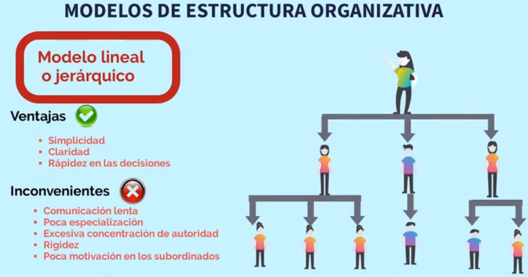
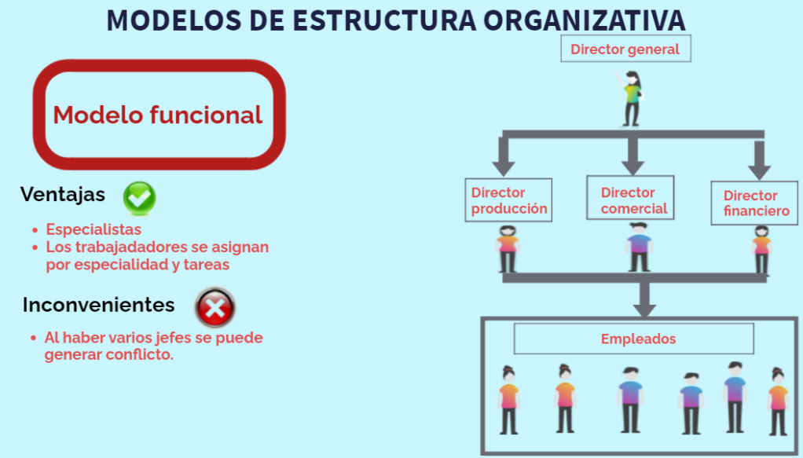
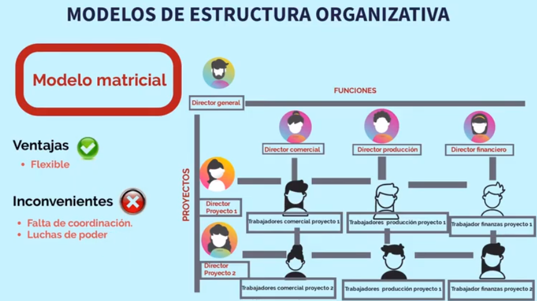
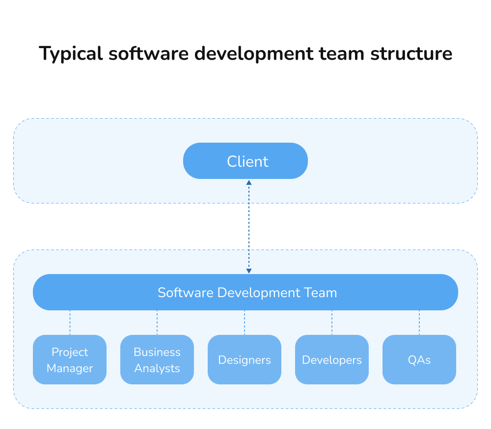

## Introducción al Mundo Empresarial y sus Estructuras

**Objetivo Principal:** Comprender los distintos tipos de estructuras empresariales.

* **Pregunta disparadora:** 
	- ¿Alguna vez pensaron cómo se organiza una empresa por dentro? 
	- ¿Quién le dice a quién qué hacer?

* **Introducción breve:** las empresas tienen diferentes formas de organizarse, como si fueran "esqueletos" distintos que les permiten funcionar.

### **Explorando las Estructuras Empresariales:**

* **Estructura Lineal o Jerárquica (Line or Hierarchical Structure):**
    * **Explicación:** Una estructura simple donde la autoridad fluye de arriba hacia abajo en una línea directa. Piensen en una cadena de mando militar.
    * **Ejemplo:** Una pequeña panadería donde el dueño supervisa directamente a los panaderos y vendedores.

* **Estructura Funcional (Functional Structure):**
    * **Explicación:** La empresa se divide por funciones o departamentos (**Departments**) (marketing, finanzas, producción, etc.). Cada departamento tiene su propio jefe (**Head of Department**).
    * **Ejemplo:** Una empresa de fabricación de ropa donde hay un departamento de diseño, otro de producción, otro de ventas, etc.

* **Estructura Matricial (Matrix Structure):**
    * **Explicación:** Los empleados tienen dos jefes: uno funcional y otro de proyecto (**Project Manager**). Se utiliza para proyectos complejos donde se necesitan habilidades de diferentes áreas.
    * **Ejemplo:** Una consultora de tecnología donde un tester puede reportar al jefe del departamento de testing y al jefe del proyecto en el que está trabajando.

 - fuente: https://economiaconinma.com/4-7-modelos-de-estructura-organizativa

**Enlaces de interes:** 

- [Video - La estructura organizacional](https://www.youtube.com/watch?v=NpsflJIWNIg)

- [Casi Creativos - Tipos de Jefes](https://www.youtube.com/watch?v=_cESORocOJU)
## La Estructura de una Empresa de Desarrollo de Software

**Objetivo Principal:** Comprender cuál es la estructura típica de una empresa de desarrollo de software.

	- ¿Cómo se imaginan que se organiza una empresa que crea programas de computadora o aplicaciones para celulares? 
	- ¿Qué departamentos o equipos creen que son importantes?

### **La Estructura Típica de una Empresa de Software:**

* **Organigrama General:**

    * **Explicación:** Un organigrama típico que incluya roles como:

        * **CEO (Chief Executive Officer):** La cabeza de la empresa.
        
		* **Project Management Office (PMO) / Project Management Department:** Los que planifican y supervisan los proyectos de software (**Project Managers**).
		
		* **Sales and Marketing Department:** Los que venden el software (**Sales Representatives**, **Marketing Specialists**).
        
		* **Development Department (Dev Dept.):** Donde los programadores (**Developers**) escriben el código.
			* **Roles dentro del equipo de Desarrollo:**
  
                [Video EdTeam - Nivel de programador](https://www.youtube.com/watch?v=L7wDwgtYC3k)

		* **UX/UI (User Experience/User Interface) Design Department:** Los que se encargan de la apariencia y la experiencia del usuario (**UX/UI Designers**).
        
		* **QA (Quality Assurance) / Testing Department:** Aseguran la calidad del software. Los testers no solo buscan errores, sino que también se aseguran de que el software cumpla con los requisitos especficados y sean intuitivos y fácil de usar.
			* **Roles dentro del equipo de Testing:** 
    			- **Junior Tester**, Comienza en el campo de la prueba de software, aprendiendo los fundamentos de la metodología y realizando pruebas manuales bajo supervisión. Sus tareas pueden incluir la ejecución de casos de prueba, la identificación de errores y la documentación de los mismos.
    			- **Senior Tester**, Tiene experiencia y conocimiento en la prueba de software, realizando pruebas más complejas y autónomas. Puede participar en la creación de casos de prueba, la gestión de errores y la colaboración con otros miembros del equipo de desarrollo.
    			- **Test Lead**, Lidera equipos de prueba, planifica las estrategias de prueba, gestiona los recursos y asegura que se cumplan los objetivos de calidad. Puede tener experiencia en pruebas manuales, automatizadas o ambas.
    			- **Automation Tester**, Se especializa en la automatización de pruebas, utilizando herramientas y tecnologías para crear y ejecutar pruebas de forma automática. Esto puede incluir pruebas de integración, pruebas funcionales y pruebas de regresión.
        			
		* **Technical Support Department:** Los que ayudan a los clientes con problemas (**Technical Support Engineers**).
        
		* **HR (Human Resources) Department:** Recursos Humanos.
        
		* **Finance Department:** Finanzas.

**Actividad Práctica: Armando el Equipo de Software**

* **Consigna:** Armar dos grupos de 6 o 7 estudiantes c/u. Imaginen que su empresa, a la cual le tienen que asignar un nombre, se dedica a desarrollar de aplicaciones moviles, se les presanta un nuevo proyecto en el cual la municipalidad de Rosario los contrata para realizar una aplicación que ayude a sus empleados a organizar sus tareas. Deben:

    * Identificar qué roles o perfiles profesionales creen que necesitarán para llevar adelante este proyecto de desarrollo de la aplicación.
    * Describir brevemente la función principal, ligada al proyecto, de cada rol que identifiquen.
    * Dibujar un organigrama específico para el equipo de desarrollo de esta aplicación, mostrando cómo se relacionan los roles.

**Puesta en común y debate**
* Cada grupo presenta su equipo de desarrollo y explica por qué eligieron esos roles y cómo los organizaron.

<!--
* Guiar la discusión hacia la importancia de la colaboración entre los diferentes roles (**Developers**, **Designers**, **Testers**, **Project Managers**, etc.). Preguntar: "¿Qué pasaría si no hubiera testers en este equipo? ¿Qué riesgos creen que correría la aplicación?"

** Cierre y anticipo:**

* Resaltar que el testing es una parte fundamental del proceso de creación de software.
* Anunciar que en la próxima clase explorarán cómo se crea el software paso a paso (el Ciclo de Vida del Desarrollo de Software).
-->

**Enlaces de interés:**

[Video - Como es una empresa de desarrollo de SW por dentro](https://www.youtube.com/watch?v=oAXOIUlC1T0)

[JalaSoft](https://www.jalasoft.com/solutions/software-qa)

https://innowise.com/es/blog/how-to-build-software-development-team-structure/
