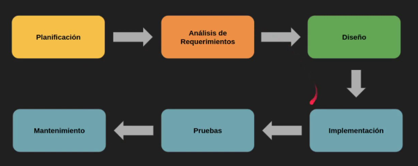
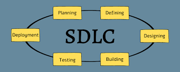
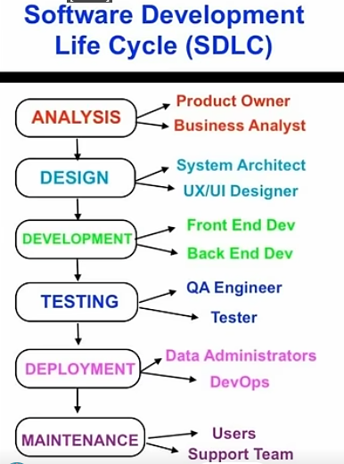
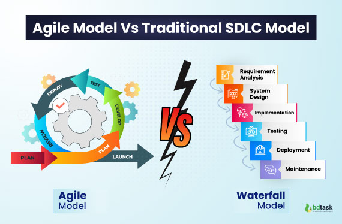
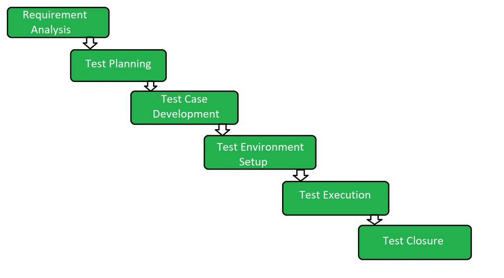

## El Ciclo de Vida del Desarrollo de Software (SDLC - Software Development Life Cycle)

**Objetivo Principal:** Conocer cuál es el ciclo de vida del desarrollo de software (SDLC).

**Repaso y conexión:**

* Recordar que las empresas de software tienen una estructura organizada para crear sus productos.
	- ¿Creen que se empieza a programar directamente una aplicación? 
	- ¿Qué pasos creen que hay antes y después de escribir el código?"

### **Desglosando el SDLC (Teoría):**

* **Explicación:** El SDLC como una serie de etapas planificadas que se siguen para construir un software de manera organizada y eficiente.

* **Etapas principales:**
    
	* **Planificación (Planning):** Definir los objetivos, alcance, recursos y cronograma del proyecto. (Ejemplo: Decidir qué funcionalidades básicas tendrá la aplicación de organización de tareas).
    * **Análisis de Requisitos (Requirements Analysis):** Entender detalladamente qué debe hacer el software. Recopilar las necesidades de los usuarios. (Ejemplo: Entrevistar a empleados para saber qué características les gustaría tener en la aplicación, relevar los horarios, los recursos y las tareas habituales).
    * **Diseño (Design):** Planificar cómo se verá y cómo funcionará el software. (Ejemplo: Crear bocetos de las pantallas de la aplicación y cómo navegar entre ellas).
    * **Implementación (Implementation / Coding):** Escribir el código del software. (Ejemplo: Los programadores escriben el código para que la aplicación funcione).
    * **Pruebas (Testing):** Verificar que el software funcione correctamente y cumpla con los requisitos. (Ejemplo: Probar que se puedan añadir tareas, marcar como completadas, recibir recordatorios, etc.).
    * **Despliegue (Deployment / Release):** Poner el software a disposición de los usuarios. (Ejemplo: Publicar la aplicación en las tiendas de aplicaciones para que los empleados la descarguen).
    * **Mantenimiento (Maintenance):** Corregir errores, añadir nuevas funcionalidades y asegurar que el software siga funcionando correctamente con el tiempo. (Ejemplo: Lanzar actualizaciones de la aplicación con nuevas funciones basadas en el feedback de los usuarios).

* **Diagramas del SDLC:** 

<!--

-->

[Video - SDLC(Ingles)](https://www.youtube.com/watch?v=Fi3_BjVzpqk)

#### **Actividad Práctica: "Ordenando las Etapas"**

* **Consigna:** 
    - Entregar a cada grupo tarjetas o tiras de papel con el nombre de cada etapa del SDLC desordenadas. 
    - Agregar una breve descripción de una actividad que creen que se lleva adelante en cada etapa
    - Pedirles que las ordenen en la secuencia correcta y expliquen por qué eligieron ese orden.

##### **Puesta en común y discusión:**

* Cada grupo presenta su orden del SDLC y justifica sus decisiones.
 - ¿Qué problemas creen que podrían surgir si se saltara alguna de estas etapas?

## SDLC Agile vs Traditional

### SDLC Tradicional (Modelos en Cascada y Similares)

En el SDLC tradicional, el modelo más representativo es el **modelo en cascada** (*Waterfall Model*). Imaginate una cascada de agua: el agua fluye en una dirección, de arriba hacia abajo, y no puede volver a una etapa anterior. 

**Características Técnicas Clave:**

* **Secuencial:** Las fases se completan una tras otra. No se avanza a la siguiente fase hasta que la anterior está formalmente terminada.
* **Orientado a la documentación:** Se genera una gran cantidad de documentación en cada fase (especificaciones de requisitos, documentos de diseño, planes de prueba, etc.).
* **Bajo nivel de interacción con el cliente durante el desarrollo:** El cliente suele participar intensamente al inicio (para definir los requisitos) y al final (para la aceptación), pero menos durante las fases intermedias.
* **Dificultad para adaptarse a los cambios:** Los cambios en los requisitos una vez que el proyecto está en fases avanzadas pueden ser costosos y disruptivos, ya que a menudo implican volver a fases anteriores.
* **Adecuado para proyectos con requisitos bien definidos y estables:** Funciona mejor cuando se sabe exactamente qué se va a construir y es poco probable que los requisitos cambien significativamente.

### SDLC Ágil (Scrum, Kanban y otros Marcos)

El SDLC ágil es un enfoque iterativo e incremental que busca entregar valor al cliente de forma temprana y continua, adaptándose a los cambios a lo largo del proyecto. Algunos de los marcos ágiles más conocidos son **Scrum** y **Kanban**.

**Conceptos Técnicos Clave:**

* **Iterativo e incremental:** El proyecto se divide en ciclos cortos de trabajo llamados **iteraciones** o **sprints** (en Scrum). Al final de cada iteración, se entrega un incremento de software funcional.
* **Desarrollo centrado en el cliente:** La colaboración con el cliente es continua y activa durante todo el proyecto para asegurar que el software cumpla con sus necesidades.
* **Equipos autoorganizados y multifuncionales:** Los equipos son pequeños, trabajan juntos y tienen las habilidades necesarias para completar las tareas sin depender de otros equipos.
* **Énfasis en el software funcionando sobre la documentación exhaustiva:** Si bien la documentación es importante, se prioriza la entrega de software útil y funcional.
* **Adaptación al cambio:** La capacidad de responder a los cambios en los requisitos es una característica fundamental. Se fomenta la flexibilidad y la adaptación continua.
* **Entrega continua de valor:** Se busca entregar software funcional en cada iteración, lo que permite al cliente obtener valor de forma temprana y recibir feedback constante.
* **Inspección y adaptación:** Se realizan reuniones periódicas (como las retrospectivas en Scrum) para analizar el proceso, identificar problemas y realizar mejoras continuas.

**Ejemplo con Scrum:**

1.  **Product Backlog:** Una lista priorizada de todas las funcionalidades, requisitos y mejoras que se desean en el software.
2.  **Sprint Planning:** El equipo selecciona un conjunto de elementos del Product Backlog para trabajar en el próximo Sprint (una iteración de duración fija, por ejemplo, 2 semanas).
3.  **Sprint Backlog:** La lista de tareas que el equipo se compromete a completar durante el Sprint.
4.  **Daily Scrum:** Una reunión diaria corta (15 minutos) donde el equipo sincroniza el trabajo y planifica las siguientes 24 horas.
5.  **Sprint Review:** Al final del Sprint, el equipo presenta el incremento de software funcional al cliente y a los stakeholders para recibir feedback.
6.  **Sprint Retrospective:** El equipo reflexiona sobre el Sprint pasado para identificar qué funcionó bien, qué se puede mejorar y cómo implementar esas mejoras en el futuro.

**En resumen:**

| Característica         | SDLC Tradicional                  | SDLC Ágil                         |
| :--------------------- | :-------------------------------- | :-------------------------------- |
| **Enfoque** | Planificación exhaustiva inicial | Adaptación y colaboración continua |
| **Entrega** | Al final del proyecto             | Iterativa e incremental           |
| **Cambios** | Difícil de incorporar            | Bienvenida y fácil de adaptar     |
| **Cliente** | Involucrado al inicio y al final  | Involucrado durante todo el ciclo |
| **Documentación** | Extensa y detallada              | Se prioriza el software funcional |
| **Riesgo** | Mayor al final del proyecto        | Se mitiga en cada iteración       |
| **Adecuado para** | Requisitos estables y definidos   | Requisitos cambiantes e inciertos |

<!--
** Cierre y anticipo:**
	* Resaltar que el testing es una etapa crucial dentro del SDLC.
	* Anunciar que la próxima clase se enfocarán específicamente en el Ciclo de Vida del Testing de Software (STLC).
-->

**Enlaces de interés:**

[Viedo (Nadia Cavalleri) - Roles con los que interactua un Tester](https://www.youtube.com/watch?v=5vId_TnDAIQ)

## El Ciclo de Vida del Testing de Software (STLC - Software Testing Life Cycle)

**Objetivo Principal:** Conocer cuál es el ciclo de vida del testing de Software (STLC).

**Repaso y conexión:**

* Recordar que el testing es una etapa fundamental dentro del SDLC.
* Preguntas: 
    * ¿Creen que los testers simplemente prueban el software al final? 
    * ¿Qué creen que hacen antes y después de ejecutar las pruebas?

**Explorando el STLC (Teoría):**

El STLC es una serie de etapas específicas que siguen los testers para planificar, diseñar, ejecutar y reportar las pruebas de software.

* **Etapas principales:**
    * **Análisis de Requisitos (Requirements Analysis):** Entender qué se debe probar. Revisar los requisitos del software desde la perspectiva del testing. (Ejemplo: Leer las especificaciones de la funcionalidad de "añadir tarea" para entender qué se espera que haga).
    * **Planificación de Pruebas (Test Planning):** Definir la estrategia de pruebas, los recursos necesarios, el alcance de las pruebas y el cronograma. (Ejemplo: Decidir qué tipos de pruebas se harán (**functional testing**, **usability testing**, etc.) y cuántos testers se necesitarán).
    * **Diseño de Casos de Prueba (Test Case Design):** Crear los casos de prueba detallados que se ejecutarán para verificar la funcionalidad del software. (Ejemplo: Escribir los pasos para probar si se puede añadir una tarea con un título, una descripción y una fecha límite).
    * **Configuración del Entorno de Pruebas (Test Environment Setup):** Preparar el ambiente donde se ejecutará el software para las pruebas (**hardware**, **software**, **test data**). (Ejemplo: Asegurarse de tener instalada la aplicación en diferentes tipos de celulares o simuladores).
    * **Ejecución de Pruebas (Test Execution):** Llevar a cabo los casos de prueba diseñados y registrar los resultados (si la prueba pasó o falló). (Ejemplo: Seguir los pasos del caso de prueba para "añadir tarea" y anotar si funcionó correctamente).
    * **Informe de Defectos (Defect Reporting):** Documentar detalladamente cualquier error o problema encontrado durante la ejecución de las pruebas. (Ejemplo: Si al intentar añadir una tarea con una fecha límite incorrecta la aplicación se cierra, registrar este error con todos los detalles necesarios para que los desarrolladores puedan corregirlo).
    * **Cierre del Ciclo de Pruebas (Test Cycle Closure):** Evaluar si se han cumplido los objetivos de las pruebas, analizar los resultados y documentalos. (Ejemplo: Una vez que se han corregido los errores críticos y se han vuelto a probar, decidir si las pruebas para esta versión de la aplicación están completas).
  

* **Diagrama del STLC:** 

_funte:_ 
 * _https://www.geeksforgeeks.org/software-testing-life-cycle-stlc/_
 * _https://www.geeksforgeeks.org/software-testing-tutorial/_

___
**Actividad Práctica: "Creando Casos de Prueba Simples"**

* **Consigna:** Volver a los grupos. Elegir una funcionalidad sencilla de la aplicación de organización de tareas (por ejemplo, "añadir una nueva tarea"). Pedirles que diseñen al menos 3 casos de prueba diferentes para verificar que esta funcionalidad funciona correctamente. Deben especificar:
    * **Título del caso de prueba (Test Case Title).**
    * **Pasos a seguir (Test Steps).**
    * **Resultado esperado (Expected Result).**

**Puesta en común y discusión:**

* Cada grupo presenta sus casos de prueba para la funcionalidad elegida.
* Analizar los diferentes casos de prueba propuestos. Preguntar: "¿Qué aspectos diferentes están probando en cada caso? ¿Por qué es importante tener varios casos de prueba para una misma funcionalidad?" Introducir brevemente la idea de diferentes tipos de pruebas (positivas, negativas, de borde).

______

### El Rol Crucial del Tester QA

**Objetivo Principal:** Visualizar que el puesto de tester QA es un rol importante dentro de una empresa de desarrollo de software.

**Pregunta:**
    Después de haber visto el SDLC y el STLC, ¿por qué creen que es importante tener testers en una empresa de software? ¿Qué pasaría si no los hubiera?

**La Importancia del Tester QA (Teoría y ejemplos):**

* **El Tester como Defensor de la Calidad:** el tester es responsable de asegurar que el software funcione correctamente, sea confiable y cumpla con las expectativas de los usuarios.

* **Beneficios del Testing:**
    * **Detección temprana de errores (Early bug detection):** Encontrar problemas antes de que lleguen a los usuarios, lo que ahorra tiempo y dinero a la empresa.
    * **Mejora de la calidad del software (Improved software quality):** Asegurar que el software sea más robusto y tenga menos fallos.
    * **Mejora de la experiencia del usuario (Enhanced user experience):** Garantizar que el software sea fácil de usar y cumpla con las necesidades de los usuarios.
    * **Reducción de riesgos (Risk reduction):** Evitar problemas graves que puedan dañar la reputación de la empresa.
    * **Aumento de la satisfacción del cliente (Increased customer satisfaction):** Entregar un producto de calidad genera confianza y lealtad en los clientes.

* **El Rol del Tester QA en el Equipo:** el tester trabaja en colaboración con desarrolladores, diseñadores y project managers. Su perspectiva es crucial para asegurar que el producto final sea exitoso.

___

[Mentimeter!](https://www.menti.com/alzkbpreaeuo)
